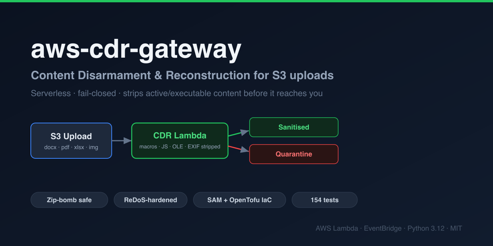
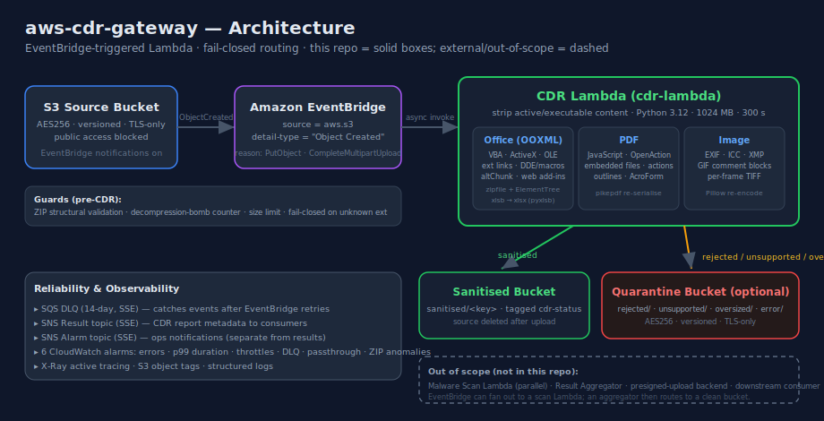

# aws-cdr-gateway



[](https://github.com/douglasmun/aws-cdr-gateway/actions/workflows/tests.yml)

A serverless AWS pipeline that performs **Content Disarmament and Reconstruction (CDR)**
on files uploaded to S3. Files are structurally disarmed — active/executable content is
stripped — and routed to a sanitised or quarantine bucket. The pipeline is designed to
**fail closed**: anything it cannot prove safe is quarantined, never labelled sanitised.

> Status: production-ready code, **Deployed and smoke tested on AWS**. Follow, the deployment
> steps below require live AWS credentials and either the SAM CLI or OpenTofu/Terraform.

---

## How it works
Detailed diagrams of the full dual-layer (CDR + malware scan + aggregator) design:


EventBridge fires on S3 `ObjectCreated` (`PutObject` / `CompleteMultipartUpload`) and
invokes the CDR Lambda, which strips active content and routes each file to the sanitised
or quarantine bucket. **This repo contains the CDR Lambda and its infrastructure** — the
malware-scan Lambda, result aggregator, and presigned-upload backend are out of scope
(see [Known gaps](docs/00-production-readiness-index.md)).

### CDR by format

| Format | Approach | What is removed |
|---|---|---|
| **Office** (all 17 OOXML/ZIP variants) | ZIP-level surgery — drop/scrub parts, never re-serialise through an Office library | VBA, ActiveX, embedded OLE/package objects, external links, query tables, connections, web add-ins, macro content types, dangerous `.rels`, field codes (DDE/AUTOOPEN/WEBSERVICE/…), `altChunk` imports; external hyperlink targets neutralised in place |
| **xlsb** (with worksheet binaries) | Format conversion via `pyxlsb` → `openpyxl` | Everything — only plain cached cell values survive; no BIFF12 records pass through |
| **PDF** | `pikepdf` surgery + full re-serialise | JavaScript, `/OpenAction`, `/AA`, embedded files, all annotation actions, `/FileAttachment` specs, multimedia annotations, outline (bookmark) actions, AcroForm field + root actions |
| **Images** (jpg/png/gif/bmp/tiff/webp) | Re-encode through Pillow | All EXIF / ICC / XMP metadata; GIF comment blocks; per-frame metadata on multi-frame TIFFs |
| **Legacy OLE** (doc/xls/ppt) | Quarantine, no CDR | — (format too opaque to safely reconstruct) |
| **Unknown extensions** | **Fail closed** — quarantine | Never reaches the sanitised bucket |

### Security guarantees baked in

- **Decompression-bomb defence** — every ZIP entry is read through a chunked byte counter
  (`_read_zip_entry_safe`) that never trusts the attacker-controlled central-directory
  `file_size`. A 90 KB entry that inflates to gigabytes is killed at the per-entry limit.
- **ZIP structural hard-rejects** — bad magic, non-standard compression, duplicate entries,
  local/central method mismatch, or a missing `[Content_Types].xml` → quarantine, no CDR.
- **ReDoS-hardened** — all neutralisation regexes are bounded; a crafted text node cannot
  hang the Lambda past its timeout.
- **Fault isolation** — SNS publish, source delete, and metric emission can never turn a
  successful CDR into an EventBridge retry of an already-sanitised file.
  adds a magic-byte gate; security guards are kept at behavioural parity.

The CDR code has been through five review passes (Codex → Gemini → a multi-agent
adversarial audit → two remediation rounds); the Terraform/build/CI was separately
audited and hardened. See [`docs/progress.md`](docs/progress.md).

---

## Repository layout

| Path | Purpose |
|---|---|
| `src/lambda_function.py` | General CDR Lambda — all Office/PDF/image formats |
| `src/template.yaml` | AWS SAM infrastructure (buckets, IAM, DLQ, alarms, EventBridge) |
| `terraform/` | Terraform port of the SAM template (parallel deploy path) |
| `scripts/build.sh` | Builds the Lambda zip with Linux wheels (for the Terraform path) |
| `src/requirements.txt` | Pinned Lambda dependencies |
| `docs/00–04` | Production-readiness manuals (setup, smoke tests, IAM review, runbook) |
| `docs/deployment-runbook.md` | End-to-end staging deploy guide |
| `docs/05-alarm-demo-walkthrough.md` | Subscribe to alarm notifications + fire the ZIP-anomaly alarm (live demo) |
| `docs/benchmark.py` | Standalone load benchmark with tuning recommendations |
| `docs/fixtures/` | Threat fixtures + generator covering every CDR path |
| `docs/comparison-docbleach.md` | CDR coverage compared against DocBleach (per-format, with audit rationale) |

---

## Development

The Lambda runtime is **Python 3.12** (per `template.yaml`); the local dev venv may be
newer. Dependencies are pinned in `src/requirements.txt`.

```bash
# Activate the virtual environment (venv at repo root)
source bin/activate

# Install dependencies
pip install -r src/requirements.txt

# Run the full test suite (154 tests)

# Run one class or test
pytest test_cdr.py::TestOfficeCDR -v
pytest test_cdr.py::TestOfficeCDR::test_vba_macro_removed -v

# Lint (byte-compile)
```

Tests construct malicious fixtures entirely in memory; S3/SNS are mocked. No live AWS
credentials are needed to run them.

### Git hooks

`main` has no server-side branch protection (a GitHub free-private-repo limitation — see
[Known Gap #6](docs/00-production-readiness-index.md)). A local `pre-push` hook stands in
for it: it blocks force-pushes and deletions of `main` in your clone. Install it once after
cloning:

```bash
./scripts/install-hooks.sh
```

The hook is tracked in `scripts/hooks/`; `.git/hooks/` is not version-controlled, so each
clone must install it. Bypass for a one-off with `git push --no-verify`.

---

## Deployment

Two equivalent IaC paths provision the same stack — pick one. Both require live AWS
credentials. See [`docs/deployment-runbook.md`](docs/deployment-runbook.md) for the full
guide and [`docs/00-production-readiness-index.md`](docs/00-production-readiness-index.md)
for the sign-off checklist.

**Option A — AWS SAM** (needs the [SAM CLI](https://docs.aws.amazon.com/serverless-application-model/latest/developerguide/install-sam-cli.html)):

```bash
cd src
sam build
sam deploy --guided          # choose bucket names, quarantine bucket, SNS subscribers
```

**Option B — OpenTofu / Terraform** (build the package, then apply; see [`terraform/README.md`](terraform/README.md)):

```bash
./scripts/build.sh           # Linux wheels + handler → build/lambda.zip
cd terraform
cp terraform.tfvars.example terraform.tfvars   # set bucket names + region
tofu init && tofu apply      # or: terraform init && terraform apply
```

Smoke test + load benchmark against the deployed stack:

```bash
python docs/benchmark.py --bucket <source-bucket> --files docs/fixtures/ \
  --log-group /aws/lambda/cdr-lambda
```

### Key configuration (SAM parameters / Terraform variables / env vars)

| Variable | Required | Default | Purpose |
|---|---|---|---|
| `SANITISED_BUCKET` | yes | — | destination for clean files |
| `QUARANTINE_BUCKET` | no | — | destination for rejected/errored/unsupported files |
| `RESULT_TOPIC_ARN` | no | — | SNS topic for CDR result metadata |
| `CDR_MAX_FILE_BYTES` | no | 100 MB | pre-download size limit |
| `CDR_MAX_ENTRY_BYTES` | no | 200 MB | per-ZIP-entry decompression limit |

The Lambda runs at 1024 MB / 300 s timeout with `ReservedConcurrentExecutions: 20`; an
SQS DLQ and CloudWatch alarms (errors, p99 duration, throttles, DLQ depth, passthrough,
ZIP anomalies) are provisioned by the template.

---

## License

[MIT](LICENSE) © 2026 Douglas Mun
