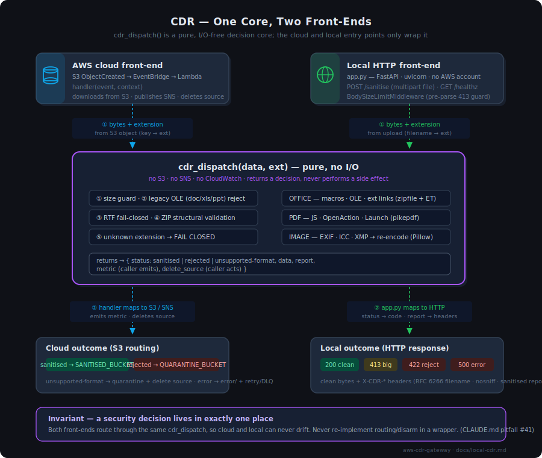

# Local CDR Service

A local HTTP front-end (`src/app.py`) that disarms files through the **same** CDR engine
the AWS Lambda uses — with **no AWS account, no S3, no SNS**. Point any local application
at it and POST a file; it returns the disarmed bytes (or a fail-closed rejection).

This is the deep reference. For the 30-second version see the
[README](../README.md#local-cdr-service-no-aws-account).



---

## 1. Why it exists

The CDR routing and disarm logic — size guard, legacy/RTF fail-close, ZIP structural
validation, unknown-extension fail-close, and the per-format disarm of Office / PDF /
images — lives in one **pure, I/O-free** function: `cdr_dispatch(data, ext)` in
`src/lambda_function.py`. It makes the decision and (when applicable) disarms the bytes,
but performs **no** S3 / SNS / CloudWatch call.

Two front-ends wrap it:

| Front-end | File | Transport | Side effects |
|---|---|---|---|
| AWS cloud | `handler()` in `lambda_function.py` | S3 ObjectCreated → EventBridge → Lambda | downloads from S3, routes to sanitised/quarantine buckets, publishes SNS, deletes source |
| **Local** | `app.py` (FastAPI) | HTTP `POST /sanitise` | none — bytes in, bytes out |

Because both call the *same* `cdr_dispatch`, a security decision (e.g. "`.svg` fails
closed") exists in exactly one place and the two front-ends **cannot drift**. This is a
hard project invariant (CLAUDE.md pitfall #41): never re-implement routing or disarm inside
a front-end.

**Use cases:** a sidecar next to an app that accepts uploads, a desktop integration, a
batch-disarm tool, CI pre-processing, an air-gapped/on-prem deployment where the AWS
pipeline isn't available.

---

## 2. Install & run

```bash
cd src
pip install -r requirements.txt -r requirements-local.txt
uvicorn app:app --host 127.0.0.1 --port 8000        # or: python app.py
```

`requirements-local.txt` (FastAPI, uvicorn, python-multipart, httpx) is **deliberately
separate** from `requirements.txt` so these never bloat the deployed Lambda layer.

Health check:

```bash
curl -sS http://127.0.0.1:8000/healthz
# {"status":"ok","office_exts":[...],"image_exts":[...],"pdf":true,
#  "rejected_by_design":["doc","ppt","rtf","xls"],"max_file_bytes":104857600}
```

---

## 3. API

### `POST /sanitise`

Multipart form upload with a single `file` field.

| Outcome | HTTP | Body | Notes |
|---|---|---|---|
| Disarmed | **200** | clean file bytes | `X-CDR-*` headers carry the report; `Content-Disposition` names the output |
| Too large | **413** | `{"status":"rejected","reason":"file too large"}` | enforced **before** the body is fully buffered (see §6) |
| Rejected / unsupported | **422** | `{"status":"rejected"\|"unsupported-format","reason":…,"original_ext":…,"sanitised_ext":…}` | ZIP anomaly, legacy OLE, RTF, or unknown extension |
| Internal error | **500** | `{"status":"error","reason":"internal disarm error"}` | unparseable input; the real exception is logged server-side only |

**Success response headers:**

| Header | Example | Meaning |
|---|---|---|
| `X-CDR-Status` | `sanitised` | always `sanitised` on a 200 |
| `X-CDR-Original-Ext` | `docm` | uploaded extension (charset/length-capped) |
| `X-CDR-Sanitised-Ext` | `docx` | output extension after any macro-enabled remap |
| `X-CDR-Mode` | `full` | disarm mode reported by the engine |
| `X-CDR-Removals` | `3` | count of removed parts/threats |
| `X-CDR-Report` | `{"format":"docm","removed":[…]}` | JSON report; **omitted** if too large or not printable-ASCII |
| `Content-Disposition` | `attachment; filename="report.docx"; filename*=UTF-8''report.docx` | RFC 6266/5987 encoded |
| `X-Content-Type-Options` | `nosniff` | defence-in-depth against MIME sniffing |

### `GET /healthz`

Liveness plus the formats this build will attempt to disarm and the current size limit.

### Examples

```bash
# Disarm a macro-enabled doc → clean .docx (note the extension remap)
curl -sS -o clean.docx -D - -F file=@dirty.docm http://127.0.0.1:8000/sanitise

# Fail-closed: RTF is rejected by design, never "sanitised"
curl -sS -F file=@note.rtf http://127.0.0.1:8000/sanitise
#   422 {"status":"unsupported-format","reason":"format rejected by design: rtf",...}

# Unknown extension also fails closed
curl -sS -F file=@image.svg http://127.0.0.1:8000/sanitise
#   422 {"status":"unsupported-format","reason":"unsupported extension: svg",...}
```

---

## 4. Supported formats

Identical to the Lambda (same `cdr_dispatch`):

- **Office (OOXML/ZIP):** `docx docm dotx dotm xlsx xlsm xltx xltm xlam xlsb pptx pptm potx
  potm ppsx ppsm ppam`. Macro-enabled extensions are disarmed and **renamed** to their clean
  equivalent (`docm→docx`, `xlsm→xlsx`, …). `xlsb` with worksheet binaries is **converted**
  to a clean `xlsx`.
- **PDF** — JavaScript, OpenAction, Launch, embedded files, annotation/AcroForm actions
  stripped (pikepdf).
- **Images** (`jpg jpeg png gif bmp tiff webp`) — re-encoded pixel-only via Pillow; EXIF /
  ICC / XMP stripped.
- **Rejected by design:** legacy OLE (`doc xls ppt`) and `rtf` → `unsupported-format`. Any
  other extension → `unsupported-format` (**fail closed** — nothing undisarmed is ever
  labelled clean).

---

## 5. Configuration

| Env var | Default | Effect |
|---|---|---|
| `CDR_MAX_FILE_BYTES` | `104857600` (100 MB) | upload size limit; over it → **413**. Read per-request, so it can be tuned without code changes. |
| `CDR_MAX_ENTRY_BYTES` | `209715200` (200 MB) | per-ZIP-entry decompression limit (zip-bomb guard inside the engine) |
| `SANITISED_BUCKET` | `local-cdr-unused` | **unused** by the local path; `app.py` sets an inert default so importing `lambda_function` (which constructs boto3 clients at import) succeeds offline |

The `AWS_*` env vars `app.py` sets are likewise inert placeholders to satisfy the import —
no AWS call is ever made on the local path.

```bash
CDR_MAX_FILE_BYTES=26214400 uvicorn app:app --port 8000   # 25 MB cap
```

---

## 6. Security model

> **Trust boundary:** this is a single-process service for **trusted local/internal use**.
> It has **no authentication and no rate limiting**. Do not expose it directly to an
> untrusted network — front it with your own auth, rate limiting, and TLS (e.g. a reverse
> proxy) first.

Within that boundary the HTTP layer is hardened. Every item below has a regression test in
`src/test_cdr_local.py`.

| Threat | Mitigation | Where |
|---|---|---|
| Oversize upload → OOM / disk-fill | `BodySizeLimitMiddleware` (pure ASGI, above routing) rejects an oversize `Content-Length` without reading the body, and counts streamed bytes — the moment the limit trips it stops forwarding the body (returns EOF to the multipart parser) so the parser can't keep buffering/spooling. The route function never runs on an oversize upload. | `BodySizeLimitMiddleware` |
| Content-Disposition header injection (crafted filename with `"` / CR-LF) | filename is `basename`d and the legacy `filename=` slot is reduced to printable ASCII; the true name rides the RFC 5987 `filename*=UTF-8''…` form | `_content_disposition` |
| Non-Latin-1 filename crashing the response (HTTP headers are Latin-1 → a CJK name made the server's header encode raise *after* a successful disarm, dropping the clean file) | the legacy `filename=` slot is ASCII-only, always Latin-1-encodable | `_content_disposition` |
| Header injection via the report (a stripped ZIP entry name carrying control chars) | `X-CDR-Report` is gated by a printable-ASCII check (note `str.isascii()` wrongly passes CR/LF) on top of `json.dumps` escaping; dropped if it doesn't qualify | `_is_clean_header_value` |
| Oversized / unbounded extension in a header | extension headers are charset/length-capped (`^[a-z0-9]{1,16}$`, else `unknown`) | `_safe_ext_header` |
| Fail-open: a "sanitised" verdict with no bytes | a `sanitised` result with `data is None` returns 500, never a 200 with an empty body labelled clean | `sanitise()` |
| Internal error info leak | the 500 body is a generic message; the real exception is logged server-side only | `sanitise()` |
| MIME sniffing | `X-Content-Type-Options: nosniff` on every 200 | `sanitise()` |

**Note on testing these:** the FastAPI `TestClient` (httpx) masks some of these bugs — it
pre-encodes the request filename and sends the body as one message. The header- and
size-injection cases are verified with a **raw socket / direct-ASGI** test, not just the
TestClient.

---

## 7. Embedding in your own app

In-process (no HTTP) — call the core directly:

```python
import lambda_function as cdr

decision = cdr.cdr_dispatch(file_bytes, "docx")
if decision["status"] == "sanitised":
    clean = decision["data"]            # bytes
    report = decision["report"]         # {"format":…, "removed":[…], "cdr_mode":…}
else:
    reason = decision["reason"]         # rejected / unsupported-format
```

`cdr_dispatch` is pure and side-effect-free, so it is safe to call from any context
(threads, batch loops, another framework). Set the inert env defaults *before* importing
`lambda_function` (see `app.py` for the pattern) so its module-level boto3 clients
construct offline.

---

## 8. Deploying behind a reverse proxy

Because the service has no built-in auth/ratelimit/TLS, terminate those upstream. Belt-and-
suspenders: also cap the body size at the proxy so oversize uploads are rejected before
they reach uvicorn.

```nginx
location /sanitise {
    client_max_body_size 100m;        # match CDR_MAX_FILE_BYTES
    proxy_pass http://127.0.0.1:8000;
    # add auth_request / rate limiting / TLS here
}
```

Run multiple uvicorn workers for throughput; the service is stateless, so any worker can
handle any request.

---

## 9. Tests

The local variant has its own suite, `src/test_cdr_local.py` (per the per-module test
rule), reusing the in-memory fixtures from `test_cdr.py`:

```bash
cd src && pytest test_cdr_local.py -v          # local variant only
cd src && pytest test_cdr.py test_cdr_local.py -v   # full suite (227 tests)
```

It proves both that `cdr_dispatch` performs no I/O and that the endpoint returns the
correct status for every routing branch, plus a regression test for each hardening item in
§6.

---

## See also

- [`../README.md`](../README.md) — project overview and quickstart
- [`cdr_architecture.svg`](cdr_architecture.svg) — the full AWS cloud pipeline
- [`00-production-readiness-index.md`](00-production-readiness-index.md) — deployment & ops manuals
- [`comparison-docbleach.md`](comparison-docbleach.md) — CDR coverage vs DocBleach
